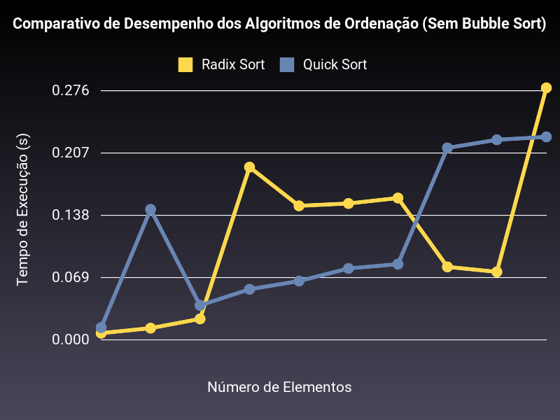
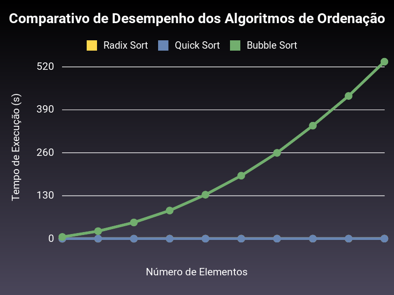

# Comparação de Desempenho de Algoritmos de Ordenação

Este projeto faz uma análise do desempenho de três algoritmos de ordenação diferentes: **Radix Sort**, **Quick Sort** e **Bubble Sort**. Para isso, executamos cada algoritmo com diferentes quantidades de elementos e registramos o tempo necessário para ordená-los. O objetivo é entender como cada algoritmo se comporta à medida que o número de elementos aumenta.

## Algoritmos Analisados

1. **Radix Sort**  
   - **Complexidade de Tempo**: \(O(n . k)\), onde \(k\) é o número de dígitos dos números. 
   - **Comportamento Observado**: O Radix Sort manteve um tempo de execução relativamente estável, mesmo com o aumento de elementos, indicando um comportamento próximo da linearidade. Isso faz sentido, pois o Radix Sort tem um desempenho eficiente para grandes volumes de dados, desde que \(k\) (o número de dígitos) não seja muito grande.
   
2. **Quick Sort**  
   - **Complexidade de Tempo**: \(O(n^2)\) no pior caso, mas \(O(n log n)\) em média.
   - **Comportamento Observado**: O Quick Sort manteve um tempo de execução consistente e eficiente. Isso sugere que ele não encontrou o pior caso (que ocorre quando os dados estão muito desordenados ou já ordenados em uma certa direção). No caso médio, o Quick Sort é bastante eficiente e mostra um crescimento de tempo em \(O(n \log n)\), que é o que foi observado.

3. **Bubble Sort**  
   - **Complexidade de Tempo**: \(O(n^2)\).
   - **Comportamento Observado**: O gráfico mostra que o Bubble Sort teve um crescimento parabólico acentuado no tempo de execução conforme o número de elementos aumentava. Isso é esperado, já que o Bubble Sort é um algoritmo quadrático e, portanto, ineficiente para grandes conjuntos de dados.

## Gráficos

### 1. Comparação Sem Bubble Sort

   - Este gráfico mostra apenas o **Radix Sort** e o **Quick Sort**. Ambos apresentam um desempenho eficiente, com o Radix Sort levemente superior, mantendo um tempo de execução quase constante.
  
### 2. Comparação Completa com Bubble Sort

   - Neste gráfico, incluímos o **Bubble Sort**. Aqui, vemos como o Bubble Sort rapidamente se torna ineficiente conforme o número de elementos cresce, enquanto o Radix Sort e o Quick Sort permanecem bastante eficientes.

## Conclusão

Os gráficos confirmam a teoria:
- **Radix Sort** e **Quick Sort** são rápidos e eficientes para grandes volumes de dados.
- **Bubble Sort** é visivelmente mais lento para entradas grandes, sendo inadequado para casos que exigem alta performance.

Esses resultados são consistentes com as complexidades de tempo teóricas, mostrando como o Radix Sort e o Quick Sort são algoritmos muito mais escaláveis que o Bubble Sort.
